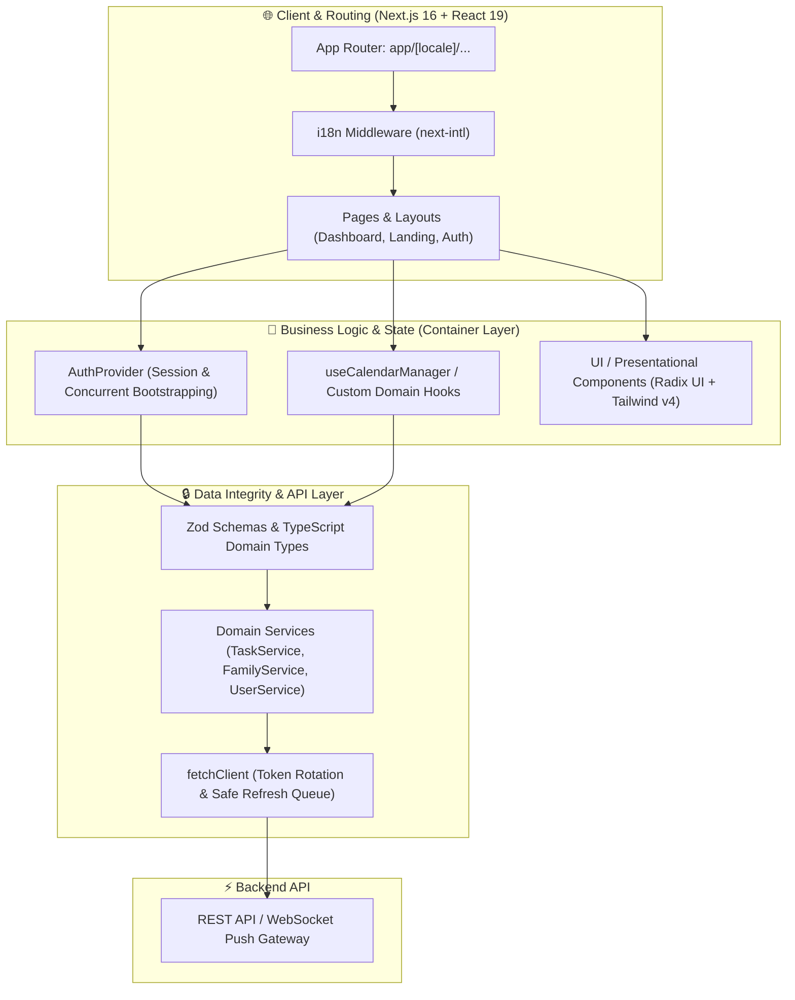

# NuestroNido - Frontend Client

[](https://nextjs.org/)
[](https://react.dev/)
[](https://www.typescriptlang.org/)
[](https://tailwindcss.com/)
[](#license)

NuestroNido (Our Nest) is a collaborative household management platform designed to help families and housemates organize their daily lives. From task management and shared calendars to notes and a gamified leaderboard, NuestroNido turns household chores into a shared, rewarding experience.

## Table of Contents

- [Features](#features)
- [Tech Stack](#tech-stack)
- [Getting Started](#getting-started)
  - [Prerequisites](#prerequisites)
  - [Environment Variables](#environment-variables)
  - [Installation](#installation)
- [Running the App](#running-the-app)
- [Project Structure](#project-structure)
- [Testing](#testing)
- [License](#license)

## Features

- **Family Management**: Create or join a "nest" to collaborate with your family members or roommates.
- **Shared Calendar**: Keep track of important dates, events, and deadlines in one central place.
- **Task Lists & Chores**: Organize household tasks and track progress.
- **Gamification**: Earn points and level up by completing tasks. A leaderboard keeps everyone motivated!
- **Shared Notes**: Quick access to shopping lists, recipes, or important household information.
- **Push Notifications**: Stay updated on new tasks, mentions, and family updates.
- **Multilingual Support**: Fully localized in English and Spanish.
- **Responsive Design**: Optimized for both desktop and mobile devices.

## Tech Stack

- **Framework**: [Next.js 16+](https://nextjs.org/) (App Router, React 19)
- **Language**: [TypeScript](https://www.typescriptlang.org/)
- **Styling**: [Tailwind CSS v4](https://tailwindcss.com/) (`@tailwindcss/postcss`, `tw-animate-css`)
- **UI Components**: [Shadcn UI](https://ui.shadcn.com/) / [Radix UI](https://www.radix-ui.com/)
- **Animations**: [Framer Motion](https://www.framer.com/motion/)
- **Forms & Validation**: [React Hook Form](https://react-hook-form.com/) & [Zod](https://zod.dev/)
- **Internationalization**: [next-intl](https://next-intl-docs.vercel.app/)
- **State Management & Data Fetching**: Custom hooks and services with [React Context](https://react.dev/learn/passing-data-deeply-with-context).
- **Testing & A11y**: [Vitest](https://vitest.dev/), [Testing Library](https://testing-library.com/), [jest-axe](https://github.com/nickcolley/jest-axe), and [Playwright](https://playwright.dev/) for E2E testing.


## Getting Started

### Prerequisites

- [Node.js](https://nodejs.org/) (v18 or higher recommended)
- [pnpm](https://pnpm.io/) (preferred) or `npm` / `yarn`

### Environment Variables

Create a `.env.local` file in the root of the `/front` directory based on the following configurations:

| Variable | Description | Example / Default | Required |
| :--- | :--- | :--- | :--- |
| `NEXT_PUBLIC_API_URL` | Base URL of the backend API | `http://localhost:8000` | Yes |
| `NEXT_PUBLIC_SUPPORT_EMAIL` | Support contact email | `support@example.com` | No |
| `NEXT_PUBLIC_VAPID_PUBLIC_KEY` | Public key for Web Push notifications | None | No |

### Installation

1. Clone the repository:

   ```bash
   git clone https://github.com/your-username/nuestronido.git
   cd nuestronido/front
   ```

2. Install dependencies:

   ```bash
   pnpm install
   ```

3. Configure environment variables:
   Create a `.env.local` file in the root directory and add your configuration (API URLs, etc.).

### Running the App

- **Development Mode**:

  ```bash
  pnpm dev
  ```

  The app will be available at `http://localhost:3000`.

- **Build for Production**:
  ```bash
  pnpm build
  pnpm start
  ```

## Architecture & System Design



## Key Architectural Highlights

- **Container / Presentational Decoupling**: Complex UI (such as the interactive task calendar) isolates state, date arithmetic, and CRUD operations into dedicated custom hooks (`useCalendarManager`), leaving the UI components pure, declarative, and easily testable.
- **Race-Condition-Safe Auth Loop**: `api-client.ts` implements a centralized `refreshPromise` queue that handles concurrent token expirations without triggering duplicate refresh requests.
- **Zero-Waterfall Bootstrapping**: Concurrent session validation using `Promise.allSettled` to optimize initial dashboard loading and Time-To-Interactive (TTI).
- **Automated Accessibility (A11y)**: Test suites run with `jest-axe` to enforce WCAG compliance directly on rendered components.

## Project Structure

```text
├── app/                  # Next.js App Router (Internationalized)
│   ├── [locale]/         # Routes wrapped in locale segments (/es, /en)
│   └── layout.tsx        # Root layout
├── components/           # React components
│   ├── auth/             # Authentication forms & flows
│   ├── dialogs/          # Reusable modal dialogs (Tasks, Notes, Settings)
│   ├── family/           # Nest creation and invitation components
│   ├── ui/               # Base UI primitives (Radix UI + Tailwind CSS v4)
│   └── ...               # Domain views (CalendarSection, NotesSection, ListSection)
├── hooks/                # Custom business logic hooks (useCalendarManager, useAuth, etc.)
├── i18n/                 # Internationalization routing & middleware
├── lib/                  # Validation schemas (Zod), types, and fetchClient
├── messages/             # Translation dictionaries (en.json, es.json)
├── public/               # Static assets & logos
├── services/             # Typed API service layers (AuthService, TaskService, etc.)
├── styles/               # Global CSS & Tailwind v4 OKLCH theme configuration
└── tests/                # Vitest (unit & a11y) and Playwright (E2E) test suites
```

## Testing

- **Run Unit & A11y Tests**:
  ```bash
  pnpm test
  ```
- **Test UI (Vitest Dashboard)**:
  ```bash
  pnpm test:ui
  ```
- **Code Coverage**:
  ```bash
  pnpm test:coverage
  ```
- **Linting & Code Quality**:
  ```bash
  pnpm lint
  ```

## License

This project is private and for internal use only.

---

Made by the NuestroNido Team.

